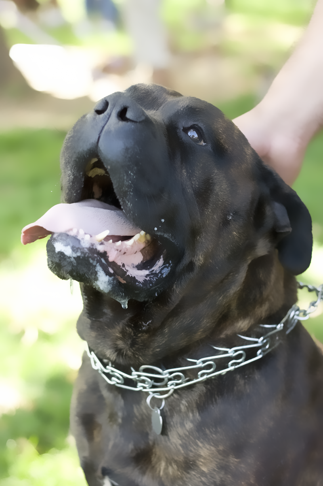
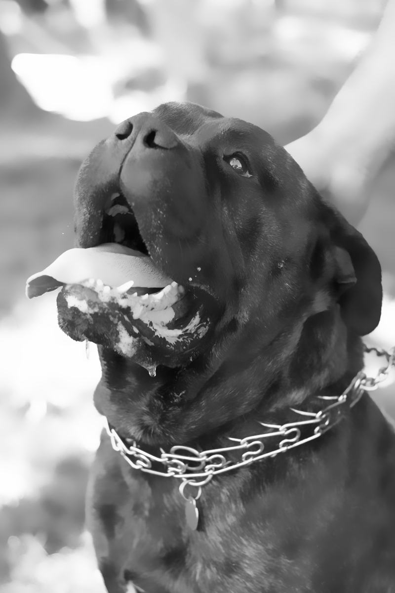

This code implements the Permutohedral Lattice  for high dimensional filtering.
Read the original [paper.]( https://graphics.stanford.edu/papers/permutohedral/)
If you use this work please consider citing our [paper](https://arxiv.org/abs/1807.07464) in addition to the original one.


The code contains:
- A CPU implementation (C++);
- A GPU implementation (C++/CUDA);
- TensorFlow Op Kernels that wrap the CPU and GPU implementations to be used in Python/TensorFlow;

This code can be used to perform (approximate) bilateral filtering, gaussian filtering, non-local means etc...
It also supports an arbitrary number of spatial dimensions, input channels and reference channels.


The TensorFlow op has gradients implemented and hence can be used with backprop, it can be used with `batch_size>=1`.
This code was made with to be used as part of larger algorithms such as Conditional Random Fields (CRFs).

 
 |  
 


#### How to compile and use

1. Install CMake (version >= 3.9).

2. Open the file `build.sh` and change the variables `CXX_COMPILER` and `CUDA_COMPILER` to the path of the C++ and nvcc
 (CUDA) compilers on your machine.
 
3. To compile the code run:
````
sh build.sh
````
This will create a directory called `build_dir` which will contain the compiled code.

###### Caveats

This script will try to compile code for both CPU and GPU at the same time, so if you don't want the GPU part
 (and want the script to run) you must change `CMakeLists.txt`.
 
Because of the way the GPU (CUDA) code is implemented, the number of spatial dimensions and number of channels of
 the input and reference images must be known at compile time. This can be changed in the `build.sh` script as well by
  changing the variables `SPATIAL_DIMS`, `INPUT_CHANNELS` and `REFERENCE_CHANNELS`.
  If you only need the CPU version this variables do nothing to it and these values can be run-time values.
            


#### Example Usage

##### CPU C++
````
./build_dir/test_bilateral_cpu Images/input.bmp Images/output.bmp 8 0.125
````
##### GPU C++/CUDA

````
./build_dir/test_bilateral_gpu Images/input.bmp Images/output.bmp 8 0.125
````

##### TensorFlow Python

Look into TFOpTests for actual working examples.

Example of bilateral filtering a 2D filtering gray scale image based on a RGB image. 
On GPU compile with `SPATIAL_DIMS=2`, `INPUT_CHANNELS=1` and `REFERENCE_CHANNELS=3`

````
import tensorflow as tf
import lattice_filter_op_loader

input = tf.placeholder(shape=(batch_size, width, height, 1))
reference = tf.placeholder(shape=(batch_size, width, height, 3))

output = module.lattice_filter(input, reference_image, bilateral=True, theta_alpha=8, theta_beta=0.125)

# Then run the graph, load, save images
````

 |  


#### Known Issues

1. The GPU version must know `SPATIAL_DIMS`, `INPUT_CHANNELS` and `REFERENCE_CHANNELS` at run time.
2. Sometimes the op does not default to use the GPU. Don't know the cause of this.
3. The CPU and GPU versions don't produce exactly the same result (0.2% different). Has to do with implementation.
4. The gradients of the TensorFlow Op don't match numerically calculated gradients for some values of the various theta 
parameters. I suspect it has something to do with numerical issues when dividing by numbers close to zero.

#### Collaborators are welcome